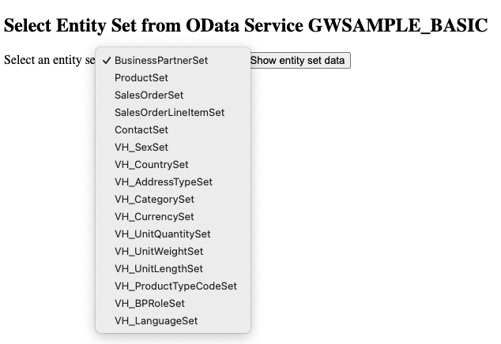

# Demo App for Reading SAP OData Service `GWSAMPLE_BASIC`

This is a minimal demo app that starts an Actix webserver to request data from the selected entity set in SAP's demo OData service `GWSAMPLE_BASIC`.

It does this in the following stages:

1. Runs a build script that consumes the XML metadata description of `GWSAMPLE_BASIC` (see the functionality in crate [`parse-sap-odata`](https://crates.io/crates/parse-sap-odata))
1. Generates a file called `gwsample_basic.rs` containing the module `gwsample_basic`
2. Using the generated `struct`s and `enum`s, the `atom:Feed` information exposed as entitysets in this OData service can then be consumed.

In this minimal demo scenario, the parsed entity set data is simply returned to the browser as formatted, plain text.

## Prerequisites

You must already have a userid and password for the SAP Dev Center server `sapes5.sapdevcenter.com`

1. Clone this repo
2. `cd parse_sap_odata_demo`
3. Create a `.env` file containing your SAP DevCenter userid and password in the following format

   ```
   SAP_USER=<your userid>
   SAP_PASSWORD=<your password>
   ```

# Local Execution

Once the `.env` file has been created, you can start the app using `cargo run`.

Visit <http://localhost:8080> and you will see a simple drop down list containing the entity sets available on the `GWSAMPLE_BASIC` OData service.



Select the desired entity set and the first 100 entries will be displayed in plain text.
This output comes from the Rust `println!()` macro printing the Rust `struct` into which the entity set data has been parsed.

## Known Issues/Workarounds

### Invalid ETag Attribute Values

When calling the SAP demo OData service `GWSAMPLE_BASIC`, various entity sets (such as `BusinessPartnerSet` and `ProductSet`) return `<entry>` tags whose `m:etag` attribute contains a value that is not in valid XML format.

The raw XML will contain `m:etag` attributes with values like this:

```xml
<entry m:etag="W/"datetime'2023-08-31T01%3A00%3A06.0000000'"">
```

The extra `"W/` characters at the start and the extra `"` character at the end are invalid XML and may cause an XML parser to throw its toys out of the pram.
So, before parsing the raw string containing this XML, such invalid values are checked for and removed.

In this case, the above `m:etag` value is sanitised to:

```xml
<entry m:etag="datetime'2023-08-31T01%3A00%3A06.0000000'">
```

### Naked Ampersand Characters

Certain text descriptions are provided that contain an unescaped (or naked) ampersand character.
For example:

```xml
<d:Category>PDAs & Organizers</d:Category>
<d:Landx>St Kitts&Nevis</d:Landx>
```

In order to stop the XML parser from barfing, this character must be replaced with its character encoding:

```xml
<d:Category>PDAs &amp; Organizers</d:Category>
<d:Landx>St Kitts&amp;Nevis</d:Landx>
```

### Partial Support for `Edm.Decimal` Fields

Fields of type `Edm.Decimal` are currently parsed using the `Decimal` deserializer in crate `rust_decimal`.

```xml
<Property Name="Price" Type="Edm.Decimal" Precision="16" Scale="3" sap:unicode="false" sap:unit="CurrencyCode" sap:label="Unit Price"/>
```

However, since this deserialzer does not consider the `Scale` and `Precision` attributes shown above, these details are currently lost when handling decimal fields.

TODO: Implement a custom deserializer for `Edm.Decimal`
